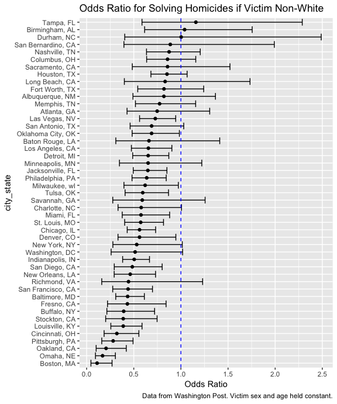
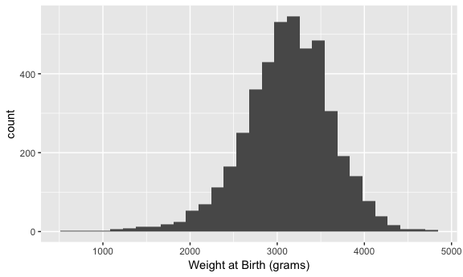
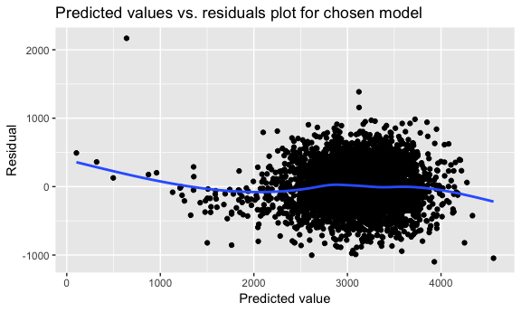
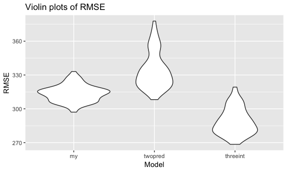

Homework 6
================
Laura Cosgrove
11/22/2018

Problem 1
---------

The Washington Post gathered homicide data on large U.S. cities, and made the data public as part of their investigation. I'll reproduce some work from last time:

``` r
homicide_data <- 
  read_csv("https://raw.githubusercontent.com/washingtonpost/data-homicides/master/homicide-data.csv") %>% 
  mutate(city_state = str_c(city, state, sep = ", "),
          resolution = factor(case_when(
            disposition == "Closed without arrest" ~ "unsolved",
            disposition == "Open/No arrest"        ~ "unsolved",
            disposition == "Closed by arrest"      ~ "solved"
          ), levels = c("unsolved", "solved")),
         victim_age = as.numeric(victim_age),
         victim_sex = factor(victim_sex)
         ) %>% 
  filter(!city_state %in% c("Tulsa, AL","Phoenix, AZ", "Dallas, TX", "Kansas City, MO")) %>% 
  mutate(victim_race = factor(case_when(
          victim_race == "White" ~ "white",
          victim_race == "Black" ~ "non-white",
          victim_race == "Hispanic" ~ "non-white",
          victim_race == "Other" ~ "non-white",
          victim_race == "Unknown" ~ "NA"), 
        levels = c("white", "non-white", "NA")
         ))
## Parsed with column specification:
## cols(
##   uid = col_character(),
##   reported_date = col_integer(),
##   victim_last = col_character(),
##   victim_first = col_character(),
##   victim_race = col_character(),
##   victim_age = col_character(),
##   victim_sex = col_character(),
##   city = col_character(),
##   state = col_character(),
##   lat = col_double(),
##   lon = col_double(),
##   disposition = col_character()
## )
## Warning: NAs introduced by coercion

#Missing values
homicide_data %>% 
  select_if(function(x) any(is.na(x))) %>% 
  summarise_each(funs(sum(is.na(.)))) %>% 
  knitr::kable()
## `summarise_each()` is deprecated.
## Use `summarise_all()`, `summarise_at()` or `summarise_if()` instead.
## To map `funs` over all variables, use `summarise_all()`
```

|  victim\_race|  victim\_age|  lat|  lon|
|-------------:|------------:|----:|----:|
|           685|          515|   60|   60|

There are 47 cities in our dataset, and 48507 cases. There is some missing data: 1.41% of cases have the victim's race missing, 1.06% have the victim's age missing, and 0.85% have geographical data missing.

I'll look more closely into Baltimore to investigate the effects of victim age, sex, and race on whether a murder is resolved or not resolved. I'll use the `glm` function to obtain the estimate for the adjusted odds ratio for the victim race predictor (comparing non-white victims against white victims) and the associated confidence interval, keeping victim sex and race constant.

``` r
glm_baltimore <- 
  homicide_data %>% 
  filter(victim_race != "NA",
         city_state == "Baltimore, MD") %>% 
  glm(resolution ~ victim_age + victim_race + victim_sex, family = "binomial", data = .)

broom::tidy(glm_baltimore, conf.int = TRUE, exponentiate = TRUE) %>% 
  filter(term == "victim_racenon-white") %>% 
  select(term, estimate, conf.low, conf.high) %>% 
  rename("Odds Ratio" = estimate) %>% 
  knitr::kable(digits = 3)
```

| term                  |  Odds Ratio|  conf.low|  conf.high|
|:----------------------|-----------:|---------:|----------:|
| victim\_racenon-white |       0.435|     0.308|      0.611|

We are 95% confident that non-white victims in Baltimore have between 0.31 - 0.61 times the odds of having their murder resolved, compared to white victims of a similar sex and age.

I'll reproduce this analysis for each of the cities in the dataset.

``` r
glm_homicides = function(df) {
  glm(resolution ~ victim_age + victim_race + victim_sex, family = "binomial", data = df)
}

glm_homicide_data <- homicide_data %>% 
  group_by(city_state) %>% 
  select(city_state, resolution, victim_age, victim_race, victim_sex) %>% 
  nest() %>% 
  mutate(glm = map(data, ~glm(resolution ~ victim_age + victim_race + victim_sex, family = "binomial", data = .x))) %>% 
  select(city_state, glm) %>% 
  mutate(glm = map(glm, broom::tidy)) %>% 
  unnest() %>% 
  filter(term == "victim_racenon-white") %>% 
  mutate(odds_ratio = exp(estimate), 
          or_lower = exp(estimate - 1.96*std.error),
          or_upper = exp(estimate + 1.96*std.error), 
          city_state = fct_reorder(city_state, estimate))
```

``` r
glm_homicide_data %>% 
  ggplot(aes(x = city_state, y = odds_ratio)) + 
  geom_point() + 
  geom_errorbar(aes(ymin = or_lower, ymax = or_upper)) + 
  geom_hline(yintercept = 1.0, linetype = "dashed", color = "blue") + 
  coord_flip() + 
  labs(y = "Odds Ratio", 
       title = "Odds Ratio for Solving Homicides if Victim Non-White",
       caption = "Data from Washington Post. Victim sex and age held constant.")
```



All but three cities in our dataset have a point estimate of decreased odds of solving homicides if the victim is nonwhite. Nineteen out of 47 cities include an equal odds ratio in their 95% confidence intervals; in other words, for nearly 60% of major U.S. cities analyzed, we can state with 95% confidence that you have decreased odds of having your case resolved if you're a victim who's not white -- even if your sex and age are similar to a white victim. What's driving this lack of parity could be factors other than race-based discrimination, but the data do show an inequity on face.

Problem 2
---------

This problem deals with a dataset containing live birth data in order to examine effects of different variables on a baby's birthweight.

``` r
birthweight_data <- read_csv("./data/birthweight.csv") %>% 
  mutate(babysex = factor(babysex, labels = c("male", "female")),
         frace = factor(frace, levels = c(1, 2, 3, 4, 8), labels = c("White", "Black", "Asian", "Puerto Rican", "Other")),
         mrace = factor(mrace, levels = c(1, 2, 3, 4), labels = c("White", "Black", "Asian", "Puerto Rican")),
         malform = factor(malform, labels = c("absent", "present"))
         )
## Parsed with column specification:
## cols(
##   .default = col_integer(),
##   gaweeks = col_double(),
##   ppbmi = col_double(),
##   smoken = col_double()
## )
## See spec(...) for full column specifications.

birthweight_data %>% 
  select_if(function(x) any(is.na(x))) %>% 
  summarise_each(funs(sum(is.na(.)))) %>% 
  knitr::kable()
## `summarise_each()` is deprecated.
## Use `summarise_all()`, `summarise_at()` or `summarise_if()` instead.
## To map `funs` over all variables, use `summarise_all()`
```

There are 4342 births, and no missing values in our data.

### Model-building.

My model-building approach will be step-wise backward elimination: the maximum number of variables will be included at the outset, and the least significant variables will be iteratively eliminated. Since the goal is exploratory, to understand the effects of several variables on birthweight, I chose a method that will allow for a generous/inclusive set of variables.

My first step will be to examine the variables list to detect those which cannot be expected to be independent (e.g. pre-pregnancy BMI and pre-pregnancy weight) and nominate one (or more) of them for exclusion to ensure variables which are clearly not independent are not included together in a model. To check this, I will create a correlation matrix of all variables to note if there are other interactions I missed:

``` r
birthweight_data %>% 
  select(bwt, everything(), -babysex, -frace, -mrace, -malform, -pnumlbw, -pnumsga) %>% #pnumlbw and pnumsga dropped because of a high number of missing values, correlations not computed
  cor() %>% 
  knitr::kable(digits = 2)
```

|          |    bwt|  bhead|  blength|  delwt|  fincome|  gaweeks|  menarche|  mheight|  momage|  parity|  ppbmi|   ppwt|  smoken|  wtgain|
|----------|------:|------:|--------:|------:|--------:|--------:|---------:|--------:|-------:|-------:|------:|------:|-------:|-------:|
| bwt      |   1.00|   0.75|     0.74|   0.29|     0.15|     0.41|     -0.02|     0.19|    0.14|   -0.01|   0.09|   0.18|   -0.08|    0.25|
| bhead    |   0.75|   1.00|     0.63|   0.21|     0.12|     0.38|      0.00|     0.12|    0.11|   -0.02|   0.09|   0.14|   -0.05|    0.18|
| blength  |   0.74|   0.63|     1.00|   0.23|     0.08|     0.36|     -0.02|     0.16|    0.08|   -0.03|   0.07|   0.15|   -0.07|    0.19|
| delwt    |   0.29|   0.21|     0.23|   1.00|     0.03|     0.12|     -0.09|     0.41|    0.07|    0.00|   0.72|   0.87|    0.05|    0.42|
| fincome  |   0.15|   0.12|     0.08|   0.03|     1.00|     0.11|      0.00|     0.13|    0.32|   -0.03|  -0.02|   0.05|    0.08|   -0.02|
| gaweeks  |   0.41|   0.38|     0.36|   0.12|     0.11|     1.00|      0.00|     0.06|    0.11|   -0.08|   0.03|   0.06|    0.04|    0.15|
| menarche |  -0.02|   0.00|    -0.02|  -0.09|     0.00|     0.00|      1.00|     0.07|    0.18|    0.02|  -0.12|  -0.07|    0.02|   -0.04|
| mheight  |   0.19|   0.12|     0.16|   0.41|     0.13|     0.06|      0.07|     1.00|    0.11|   -0.01|  -0.10|   0.43|    0.06|    0.05|
| momage   |   0.14|   0.11|     0.08|   0.07|     0.32|     0.11|      0.18|     0.11|    1.00|    0.05|   0.08|   0.13|    0.08|   -0.09|
| parity   |  -0.01|  -0.02|    -0.03|   0.00|    -0.03|    -0.08|      0.02|    -0.01|    0.05|    1.00|  -0.01|  -0.01|   -0.01|    0.01|
| ppbmi    |   0.09|   0.09|     0.07|   0.72|    -0.02|     0.03|     -0.12|    -0.10|    0.08|   -0.01|   1.00|   0.85|    0.01|   -0.11|
| ppwt     |   0.18|   0.14|     0.15|   0.87|     0.05|     0.06|     -0.07|     0.43|    0.13|   -0.01|   0.85|   1.00|    0.04|   -0.07|
| smoken   |  -0.08|  -0.05|    -0.07|   0.05|     0.08|     0.04|      0.02|     0.06|    0.08|   -0.01|   0.01|   0.04|    1.00|    0.03|
| wtgain   |   0.25|   0.18|     0.19|   0.42|    -0.02|     0.15|     -0.04|     0.05|   -0.09|    0.01|  -0.11|  -0.07|    0.03|    1.00|

For continuous variables, there is high predictor correlation, providing evidence of multicollinearity, between:

-   bhead and blength;

-   ppwt and delwt and ppbmi

Of the first, I'll keep `bhead` (baby's head circumfrence) because of its higher correlation with the outcome, baby weight. Of the second, I'll keep `delwt` because of its comparative higher correlation with baby weight as well.

For categorical variables, there is likely an interaction between `frace` and `mrace`. I'll exclude the father's race from the model because it seems less relevant, and note to explore at a later date.

Next, I'll plot the distribution of the outcome to check for a reasonable normality assumption.

``` r
birthweight_data %>% 
  ggplot(aes(x = bwt)) + 
  geom_histogram() + 
  labs( x = "Weight at Birth (grams)")
## `stat_bin()` using `bins = 30`. Pick better value with `binwidth`.
```



The outcome is not perfectly normal, but it's close enough to be sufficient.

I'll start by including all variables in the model aside from the above-decided exclusions:

``` r
birthweight_data %>% 
  lm(bwt ~ bhead + delwt + fincome + gaweeks + malform + menarche + mheight + momage + mrace + parity + pnumlbw + pnumsga + smoken + wtgain, data = .) %>% 
  tidy() %>% 
  arrange(p.value)
## # A tibble: 15 x 5
##    term                estimate std.error statistic   p.value
##    <chr>                  <dbl>     <dbl>     <dbl>     <dbl>
##  1 bhead               197.         3.30    59.5    0.       
##  2 (Intercept)       -5243.       158.     -33.1    1.30e-214
##  3 mraceBlack         -174.        11.7    -14.9    8.93e- 49
##  4 gaweeks              20.3        1.65    12.3    3.38e- 34
##  5 smoken               -6.75       0.670  -10.1    1.30e- 23
##  6 wtgain                3.55       0.496    7.15   9.90e- 13
##  7 delwt                 1.90       0.270    7.01   2.67e- 12
##  8 mheight              12.1        2.06     5.86   4.94e-  9
##  9 mracePuerto Rican  -124.        22.2     -5.56   2.80e-  8
## 10 menarche             -5.82       3.32    -1.75   7.96e-  2
## 11 parity               79.1       46.4      1.70   8.87e-  2
## 12 mraceAsian          -79.5       49.1     -1.62   1.05e-  1
## 13 malformpresent      -34.6       81.1     -0.427  6.69e-  1
## 14 fincome               0.0326     0.206    0.158  8.74e-  1
## 15 momage                0.0734     1.40     0.0524 9.58e-  1
```

`momage` is first to remove.

``` r
birthweight_data %>% 
  lm(bwt ~ bhead + delwt + fincome + gaweeks + malform + menarche + mheight + mrace + parity + smoken + wtgain, data = .) %>% 
  tidy() %>% 
  arrange(p.value)
## # A tibble: 14 x 5
##    term                estimate std.error statistic   p.value
##    <chr>                  <dbl>     <dbl>     <dbl>     <dbl>
##  1 bhead               197.         3.30     59.5   0.       
##  2 (Intercept)       -5243.       158.      -33.2   7.66e-216
##  3 mraceBlack         -174.        11.3     -15.3   1.11e- 51
##  4 gaweeks              20.3        1.65     12.3   2.65e- 34
##  5 smoken               -6.75       0.670   -10.1   1.28e- 23
##  6 wtgain                3.55       0.490     7.23  5.54e- 13
##  7 delwt                 1.90       0.268     7.09  1.54e- 12
##  8 mheight              12.1        2.06      5.86  4.93e-  9
##  9 mracePuerto Rican  -124.        22.2      -5.58  2.59e-  8
## 10 menarche             -5.79       3.26     -1.78  7.58e-  2
## 11 parity               79.3       46.3       1.71  8.71e-  2
## 12 mraceAsian          -79.2       48.7      -1.63  1.04e-  1
## 13 malformpresent      -34.5       81.0      -0.426 6.70e-  1
## 14 fincome               0.0349     0.201     0.174 8.62e-  1
```

`fincome` is also insignificant.

``` r
birthweight_data %>% 
  lm(bwt ~ bhead + delwt + gaweeks + malform + menarche + mheight + mrace + parity + smoken + wtgain, data = .) %>% 
  tidy() %>% 
  arrange(p.value)
## # A tibble: 13 x 5
##    term              estimate std.error statistic   p.value
##    <chr>                <dbl>     <dbl>     <dbl>     <dbl>
##  1 bhead               197.       3.30     59.6   0.       
##  2 (Intercept)       -5243.     158.      -33.2   5.62e-216
##  3 mraceBlack         -174.      10.6     -16.5   1.68e- 59
##  4 gaweeks              20.4      1.65     12.3   2.36e- 34
##  5 smoken               -6.75     0.669   -10.1   1.18e- 23
##  6 wtgain                3.54     0.490     7.23  5.58e- 13
##  7 delwt                 1.90     0.268     7.09  1.53e- 12
##  8 mheight              12.1      2.05      5.89  4.05e-  9
##  9 mracePuerto Rican  -124.      21.9      -5.67  1.54e-  8
## 10 menarche             -5.80     3.26     -1.78  7.54e-  2
## 11 parity               79.1     46.3       1.71  8.76e-  2
## 12 mraceAsian          -79.5     48.7      -1.63  1.02e-  1
## 13 malformpresent      -34.8     81.0      -0.429 6.68e-  1
```

Dropping `malform` as the presence is insignificant. This is surprising!

``` r
birthweight_data %>% 
  lm(bwt ~ bhead + delwt + gaweeks + menarche + mheight + mrace + parity + smoken + wtgain, data = .) %>% 
  tidy() %>% 
  arrange(p.value)
## # A tibble: 12 x 5
##    term              estimate std.error statistic   p.value
##    <chr>                <dbl>     <dbl>     <dbl>     <dbl>
##  1 bhead               197.       3.30      59.6  0.       
##  2 (Intercept)       -5244.     158.       -33.3  3.59e-216
##  3 mraceBlack         -174.      10.6      -16.5  1.78e- 59
##  4 gaweeks              20.4      1.65      12.3  2.14e- 34
##  5 smoken               -6.76     0.669    -10.1  1.00e- 23
##  6 wtgain                3.54     0.490      7.22 5.92e- 13
##  7 delwt                 1.90     0.268      7.09 1.54e- 12
##  8 mheight              12.1      2.05       5.90 3.87e-  9
##  9 mracePuerto Rican  -124.      21.9       -5.66 1.60e-  8
## 10 menarche             -5.79     3.26      -1.78 7.58e-  2
## 11 parity               79.1     46.3        1.71 8.74e-  2
## 12 mraceAsian          -79.4     48.7       -1.63 1.03e-  1
```

Compared to the reference category of the mother's race being white, the mother's race being asian has an insignificant effect on birthweight. This is a possible candidate for grouping white and asian mothers together, but since the mother's race being black has a very significant effect on the birthweight, I will keep mrace in the model.

The effects `menarche` and `parity` are above the 5% significance level. Since the model is for exploratory and descriptive purposes, I will run a partial F-test to see will examine the model diagnostics before eliminating them.

``` r
birthweight_data %>% 
  lm(bwt ~ bhead + delwt + gaweeks + mheight + mrace + smoken + wtgain, data = .) %>% 
  tidy() %>% 
  arrange(p.value)
## # A tibble: 10 x 5
##    term              estimate std.error statistic   p.value
##    <chr>                <dbl>     <dbl>     <dbl>     <dbl>
##  1 bhead               197.       3.30      59.5  0.       
##  2 (Intercept)       -5284.     155.       -34.0  2.68e-225
##  3 mraceBlack         -175.      10.6      -16.5  1.24e- 59
##  4 gaweeks              20.1      1.65      12.2  7.95e- 34
##  5 smoken               -6.79     0.669    -10.1  6.60e- 24
##  6 delwt                 1.95     0.266      7.34 2.62e- 13
##  7 wtgain                3.55     0.490      7.25 5.00e- 13
##  8 mracePuerto Rican  -125.      21.9       -5.73 1.10e-  8
##  9 mheight              11.6      2.04       5.71 1.22e-  8
## 10 mraceAsian          -85.7     48.6       -1.76 7.76e-  2

generous_model <-  lm(bwt ~ bhead + delwt + gaweeks + menarche + mheight + mrace + parity + smoken + wtgain, data = birthweight_data)
lessgen_model <-  lm(bwt ~ bhead + delwt + gaweeks + mheight + mrace + smoken + parity + wtgain, data = birthweight_data)
anova(lessgen_model, generous_model)
## Analysis of Variance Table
## 
## Model 1: bwt ~ bhead + delwt + gaweeks + mheight + mrace + smoken + parity + 
##     wtgain
## Model 2: bwt ~ bhead + delwt + gaweeks + menarche + mheight + mrace + 
##     parity + smoken + wtgain
##   Res.Df       RSS Df Sum of Sq     F  Pr(>F)  
## 1   4331 423688712                             
## 2   4330 423380317  1    308395 3.154 0.07581 .
## ---
## Signif. codes:  0 '***' 0.001 '**' 0.01 '*' 0.05 '.' 0.1 ' ' 1
```

We failed to reject the null hypothesis that the less generous model, without `menarche` and `parity` is preferred, so I'll proceed with that model.

``` r
birthweight_data %>% 
  add_predictions(lessgen_model) %>% 
  add_residuals(lessgen_model) %>% 
  ggplot(aes(x = pred, y = resid)) + 
  geom_point() + 
  geom_smooth(se = FALSE) + 
  labs(title = "Predicted values vs. residuals plot for chosen model", 
       x = "Predicted value", 
       y = "Residual")
## `geom_smooth()` using method = 'gam' and formula 'y ~ s(x, bs = "cs")'
```



The model poorly predicts outcomes at low birthweights, under 2000 grams. Influential points seem to be present, particularly at lower birthweights. However, in the most common range for birthweights, the residuals appear to be evenly spread around zero, indicating no violation of error assumptions in those ranges.

### Comparing model

Now, I'll compare my model to two others, using the cross-validated (created with `modelr::crossv_mc`) prediction error as measured by RMSE:

-   One using length at birth and gestational age as predictors (main effects only)

-   One using head circumference, length, sex, and all interactions (including the three-way interaction) between these

``` r
twopred_mod <- lm(bwt ~ blength + gaweeks, data = birthweight_data)
threeint_mod <- lm(bwt ~ bhead + blength + babysex + bhead:blength + babysex:blength + babysex:bhead, data = birthweight_data)

cv_bweight <- crossv_mc(birthweight_data, 100)

cv_bweight <- cv_bweight %>% 
  mutate(my_mod = map(train, ~lm(bwt ~ bhead + delwt + gaweeks + mheight + mrace + smoken + wtgain, data = .x)), 
         twopred_mod = map(train, ~lm(bwt ~ blength + gaweeks, data = .x)), 
         threeint_mod = map(train, ~lm(bwt ~ bhead + blength + babysex + bhead:blength + babysex:blength + babysex:bhead, data = .x))) %>% 
  mutate(rmse_my = map2_dbl(my_mod, test, ~rmse(model = .x, data = .y)),
         rmse_twopred = map2_dbl(twopred_mod, test, ~rmse(model = .x, data = .y)),
         rmse_threeint = map2_dbl(threeint_mod, test, ~rmse(model = .x, data = .y)))

cv_bweight %>% 
  select(starts_with("rmse")) %>% 
  gather(key = model, value = rmse) %>% 
  mutate(model = str_replace(model, "rmse_", ""),
         model = fct_inorder(model)) %>% 
  ggplot(aes(x = model, y = rmse)) + 
  geom_violin() + 
  labs(title = "Violin plots of RMSE", 
       x = "Model", 
       y = "RMSE")
```



The model with three interactions has a lower RMSE. If the goal is to make predictions, I would choose the model that is based on the interactions between the baby's sex, head circumfrence, and length to predict birthweight. However, if the goal is to explore other, non-obvious factors of birthweight, such as mother's race, weight gain during pregnancy, history of smoking, and other factors that might be relevant from clinical guidance and equity of care standpoints, I would work to further optimize my model, perhaps including more interaction factors.

If prediction is my main goal, I made some missteps. In particular, I eliminated the baby's sex as a predictor variable very early on in model building using the stepwise method, but that could be because I failed to consider the interaction of the baby's sex with length and head circumfrence. What seems even more likely is that instead of eliminating baby length as a variable due to high correlation in an effort to avoid multicollinearity, I should have included the interaction between baby's head circumfrence and baby length in order to maximize predictive value.
