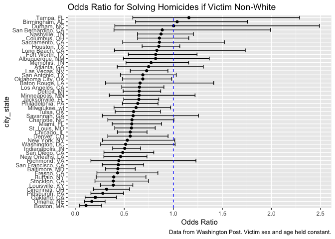

Homework 6
================
Laura Cosgrove
11/22/2018

Problem 1
---------

The Washington Post gathered homicide data on large U.S. cities, and made the data public as part of their investigation. I'll reproduce some work from last time:

``` r
homicide_data <- 
  read_csv("https://raw.githubusercontent.com/washingtonpost/data-homicides/master/homicide-data.csv") %>% 
  mutate(city_state = str_c(city, state, sep = ", "),
          resolution = factor(case_when(
            disposition == "Closed without arrest" ~ "unsolved",
            disposition == "Open/No arrest"        ~ "unsolved",
            disposition == "Closed by arrest"      ~ "solved"
          ), levels = c("unsolved", "solved")),
         victim_age = as.numeric(victim_age),
         victim_sex = factor(victim_sex)
         ) %>% 
  filter(!city_state %in% c("Tulsa, AL","Phoenix, AZ", "Dallas, TX", "Kansas City, MO")) %>% 
  mutate(victim_race = factor(case_when(
          victim_race == "White" ~ "white",
          victim_race == "Black" ~ "non-white",
          victim_race == "Hispanic" ~ "non-white",
          victim_race == "Other" ~ "non-white",
          victim_race == "Unknown" ~ "NA"), 
        levels = c("white", "non-white", "NA")
         ))
```

    ## Parsed with column specification:
    ## cols(
    ##   uid = col_character(),
    ##   reported_date = col_integer(),
    ##   victim_last = col_character(),
    ##   victim_first = col_character(),
    ##   victim_race = col_character(),
    ##   victim_age = col_character(),
    ##   victim_sex = col_character(),
    ##   city = col_character(),
    ##   state = col_character(),
    ##   lat = col_double(),
    ##   lon = col_double(),
    ##   disposition = col_character()
    ## )

    ## Warning: NAs introduced by coercion

I'll look more closely into Baltimore

Create a city\_state variable (e.g. “Baltimore, MD”), and a binary variable indicating whether the homicide is solved. Omit cities Dallas, TX; Phoenix, AZ; and Kansas City, MO – these don’t report victim race. Also omit Tulsa, AL – this is a data entry mistake. Modifiy victim\_race to have categories white and non-white, with white as the reference category. Be sure that victim\_age is numeric. check

For the city of Baltimore, MD, use the glm function to fit a logistic regression with resolved vs unresolved as the outcome and victim age, sex and race (as just defined) as predictors. Save the output of glm as an R object; apply the broom::tidy to this object; and obtain the estimate and confidence interval of the adjusted odds ratio for solving homicides comparing non-white victims to white victims keeping all other variables fixed.

``` r
glm_baltimore <- 
  homicide_data %>% 
  filter(victim_race != "NA",
         city_state == "Baltimore, MD") %>% 
  glm(resolution ~ victim_age + victim_race + victim_sex, family = "binomial", data = .)

broom::tidy(glm_baltimore, conf.int = TRUE, exponentiate = TRUE) %>% 
  filter(term == "victim_racenon-white") %>% 
  select(term, estimate, conf.low, conf.high) %>% 
  rename("Odds Ratio" = estimate) %>% 
  knitr::kable(digits = 3)
```

| term                  |  Odds Ratio|  conf.low|  conf.high|
|:----------------------|-----------:|---------:|----------:|
| victim\_racenon-white |       0.435|     0.308|      0.611|

Now run glm for each of the cities in your dataset, and extract the adjusted odds ratio (and CI) for solving homicides comparing non-white victims to white victims. Do this within a “tidy” pipeline, making use of purrr::map, list columns, and unnest as necessary to create a dataframe with estimated ORs and CIs for each city.

``` r
glm_homicides = function(df) {
  glm(resolution ~ victim_age + victim_race + victim_sex, family = "binomial", data = df)
}

glm_homicide_data <- homicide_data %>% 
  group_by(city_state) %>% 
  select(city_state, resolution, victim_age, victim_race, victim_sex) %>% 
  nest() %>% 
  mutate(glm = map(data, ~glm(resolution ~ victim_age + victim_race + victim_sex, family = "binomial", data = .x))) %>% 
  select(city_state, glm) %>% 
  mutate(glm = map(glm, broom::tidy)) %>% 
  unnest() %>% 
  filter(term == "victim_racenon-white") %>% 
  mutate(odds_ratio = exp(estimate), 
          or_lower = exp(estimate - 1.96*std.error),
          or_upper = exp(estimate + 1.96*std.error), 
          city_state = fct_reorder(city_state, estimate))

glm_homicide_data %>% 
  ggplot(aes(x = city_state, y = odds_ratio)) + 
  geom_point() + 
  geom_errorbar(aes(ymin = or_lower, ymax = or_upper)) + 
  geom_hline(yintercept = 1.0, linetype = "dashed", color = "blue") + 
  coord_flip() + 
  labs(y = "Odds Ratio", 
       title = "Odds Ratio for Solving Homicides if Victim Non-White",
       caption = "Data from Washington Post. Victim sex and age held constant.")
```



Create a plot that shows the estimated ORs and CIs for each city. Organize cities according to estimated OR, and comment on the plot.
